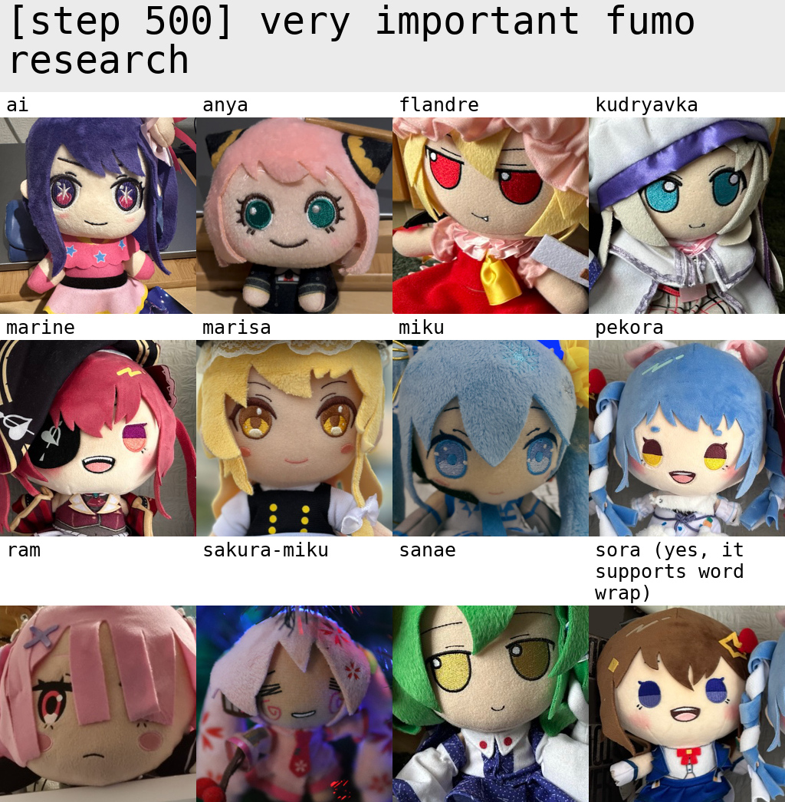
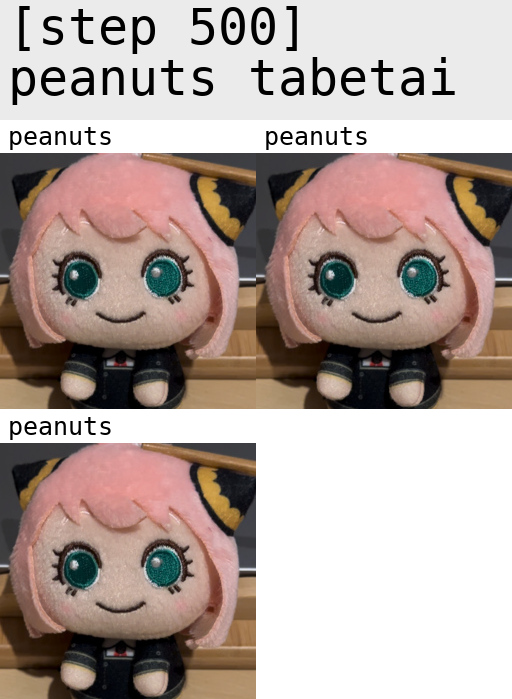

# Grid Printer

Prints PIL images to a grid, with captions and a title.

```python
grid: Image.Image = captioner(
  imgs=samples,
  captions=captions,
  title='[step 500] very important fumo research'
)
```

.

### Usage

See [`demo.ipynb`](demo.ipynb) for more example usage.

```python
from PIL import Image, ImageFont
from typing import List

from grid_printer.make_captioned_grid import Typesetting, GridCaptioner, make_typesetting, make_grid_captioner

# on systems such as RHEL, you might find your fonts are installed inside /usr/share/fonts
# we ship a copy of DejaVu Sans for your convenience
deja_vu_sans_path = "font/DejaVuSansMono.ttf"
cell_font = ImageFont.truetype(deja_vu_sans_path, 25)
title_font = ImageFont.truetype(deja_vu_sans_path, 50)
# if you don't have a font handy, you can use:
# ImageFont.load_default()

pad = 8
cell_pad = mcg.BBox(top=pad, left=pad, bottom=pad, right=pad)
# abusing bottom padding to simulate a margin-bottom
title_pad = mcg.BBox(top=pad, left=pad, bottom=pad*3, right=pad)

cols=2

sample_count=3
sample: Image.Image = Image.open(f'asset/anya.jpg')
samples: List[Image.Image] = [sample]*sample_count

cell_type: Typesetting = make_typesetting(
  x_wrap_px=sample.width,
  font=cell_font,
  padding=cell_pad,
)
title_type: Typesetting = make_typesetting(
  x_wrap_px=sample.width*cols,
  font=title_font,
  padding=title_pad,
)

captioner: GridCaptioner = make_grid_captioner(
  cell_type=cell_type,
  cols=cols,
  samp_w=sample.width,
  samp_h=sample.height,
  title_type=title_type,
)

grid: Image.Image = captioner(
  imgs=samples,
  captions=['peanuts']*sample_count,
  title='[step 500] peanuts tabetai'
)

grid.save('peanuts-grid.jpg', subsampling=0, quality=97)
```

.